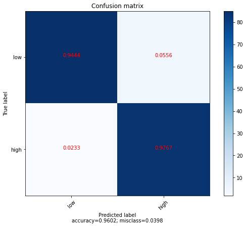

## Can You Trust the Borrower?

The goal of this machine learning project is to predict whether a borrower will pay back the loan. We'll be working with financial lending data from Lending Club. Lending Club is a marketplace for personal loans that matches borrowers who are seeking a loan with investors looking to lend money and make a return.

We have the approved loans data from 2007 to 2011. The approved loans datasets contain information on current loans, completed loans, and defaulted loans. The problem statement for this machine learning project: Can we build a machine learning model that can accurately predict if a borrower will pay off their loan on time or not?

We've first cleaned the dataset and done some feature engineering. Then we have used several machine learning models to fit the data and finally found the this result: 

